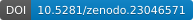
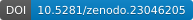

------------------------------------------------------------------------

editor: markdown: wrap: 72 ---

# NOAA Fisheries Glider Rodeo 2026

## Link to Final Report, etc

*Stay Tuned for Final report!*

Zenodo Links:\
[NOAA Fisheries Glider Rodeo 2026 Preliminary Hackathon Dataset](https://zenodo.org/records/23046205)

 [NMFS-PAM-GLider/GliderRodeo: Glider Rodeo & Hackathon v1.0](https://zenodo.org/records/23046571)

## How to Cite

@misc{glider-rodeo2026compendium, author = {Rankin, Shannon, Fregosi, Selene and Burger, Kourtney}, title = {Research Compendium for NOAA Fisheries Glider Rodeo}, year = {2026}, version = {v1.0}, publisher = {Zenodo}, doi = {10.5281/zenodo.23046571}, url = {https://github.com/NMFS-PAM-Glider/GliderRodeo} }

## Research Compendium

This repository contains data and code for the ***2026 NOAA Fisheries Glider Rodeo*** including:

## Contents

This directory contains:

- 📁 hackathon: Contains hackathon book info, and:
  - 📁 hackathon-shared-repo: contains hackathon pilot projects and related info
  - 📁 slides: PDFs of presentation slides

- 📁 manuscript: Manuscript for Report

- 📁 content: chapters/sections for online version; includes 📁 images subfolder for online figures

- 📁 data: contains summarized data for reports

- 📁 output: Include any modified or intermediate data or data products, including flowcharts (data in data folder is ORIGINAL, and data in output may be modified using code stored in R folder.

- 📁 \_code: scripts that actually do things.

- 📁 supplement: Supplementary files that are not data, script, or components of the manuscript

## Updates for Reproducible Workflows

Periodically renv::snapshot() should be run to save the state of the project library to lockfile (to ensure reproducibility).

## Funding

The Glider Rodeo was funded by NOAA Fisheries as part of their modernization efforts.

### Disclaimer

This repository is a scientific product and is not official communication of the National Oceanic and Atmospheric Administration, or the United States Department of Commerce. All NOAA GitHub project content is provided on an 'as is' basis and the user assumes responsibility for its use. Any claims against the Department of Commerce or Department of Commerce bureaus stemming from the use of this GitHub project will be governed by all applicable Federal law. Any reference to specific commercial products, processes, or services by service mark, trademark, manufacturer, or otherwise, does not constitute or imply their endorsement, recommendation or favoring by the Department of Commerce. The Department of Commerce seal and logo, or the seal and logo of a DOC bureau, shall not be used in any manner to imply endorsement of any commercial product or activity by DOC or the United States Government.

### License

This content was created by U.S. Government employees as part of their official duties. This content is not subject to copyright in the United States (17 U.S.C. §105) and is in the public domain within the United States of America. Additionally, copyright is waived worldwide through the CC0 1.0 Universal public domain dedication.

