## Partners

#### *Pacific Islands Fisheries Science Center*

#### *Southwest Fisheries Science Center*

#### *Oregon State University, CIMERS*

The Cooperative Institute for Marine and Ecosystem Resources Studies (CIMERS) and Marine Mammal Institute (MMI) at Oregon State University are world leaders in marine mammal and bioacoustics research.

They were involved in some of the earliest development to use gliders for marine mammal passive acoustic research and have conducted glider missions in many ocean basins for the U.S. Navy, BOEM, and NOAA.

Participants: [Selene Fregosi](selene.fregosi@noaa.gov), [Dave Mellinger](dave.mellinger@noaa.gov)

#### *Cornell University*

K. Lisa Yang Center for Conservation Bioacoustics provided Hefring OceanScout gliders.

Participants: [Maria Vasilkin](mv478@cornell.edu)

#### *Teledyne Webb Research*

Teledyne Webb Research, in conjunction with JASCO Applied Sciences, provide a Slocum glider equipped with a JASCO OceanObserver acoustic sensor.

Participants:[Karl Boettger](karl.boettger@teledyne.com), [Shea Quinn](Shea.Quinn@teledyne.com), [Cordie Goodrich](cordielyn.goodrich@teledyne.com)

#### *Alseamar*

Alseamar provided an Alseamar SeaExplorer glider outfitted with an Auris acoustic sensor.

Participants: [Camille Pierini](cpierini@alseamar-alcen.com), [Laurent Beguery](LBEGUERY@alseamar-alcen.com)

#### *JASCO Applied Science*

JASCO Applied Sciences, in conjunction with Teledyne Webb Research, provided a JASCO OceanObserver acoustic sensor on a Slocum.

#### *University of Hawaii Marine Center*

Special thanks to [UH Marine Center](https://www.soest.hawaii.edu/UHMC/) for providing charter vessel support

## Trackline Planning

*Stay Tuned!*

## Communications

PIFSC/SWFSC communication teams facilitated the creating and amplification of a series of integrated outreach/communications events that highlight how we are assessing capabilities of various passive acoustic glider systems to inform a transition to operations. These efforts were outlined in a Communications and Outreach plan developed by PIFSC ([Stefanie Gutierrez](stefanie.gutierrez@noaa.gov)) and SWFSC ([Sarah Mesnick](sarah.mesnick@noaa.gov)).

*Communications included:*

February 5, 2026, NOAA Featured Web Story: [NOAA Fisheries Launches Underwater Glider Challenge in Hawai‘i]()https://www.fisheries.noaa.gov/feature-story/noaa-fisheries-launches-underwater-glider-challenge-hawaii (Stefanie Gutierrez) February 5, 2026, Sound Bytes Blog: [Meet the Pilots of the Underwater Glider Challenge](https://www.fisheries.noaa.gov/science-blog/sound-bytes-meet-pilots-underwater-glider-challenge) (Kourtney Burger)

March 28, 2026, Sound Bytes Blog: XXXX (Selene Fregosi)

## Data Offload

Data from the Hefring Ocean Scout and the Alseamar SeaExplorer gliders were offloaded at the end of the Glider Rodeo prior to shipping the gliders.

At the end of the Glider Rodeo, the Seagliders started a mission with additional tracklines associated with the WHICEAS survey, and data was downloaded when these gliders returned from their second mission.

Data download from the Slocum requires access to the internal acoustic module and was conducted after the glider returned to its home port (La Jolla, CA).

## Field Reports

Brief summaries were provided for the SWFSC Weekly Reports during the Glider Rodeo fieldwork ([Feb 2,](https://drive.google.com/file/d/1ef5zI-_UE4WJwWlxOpZdEz625DopJ44u/view?usp=drivesdk) [Feb 9](https://drive.google.com/file/d/1w-aB2o7pMtN3jAHkogazJ11-pYViMWFv/view?usp=drivesdk), [Feb17](https://drive.google.com/file/d/1LPmR2GF-eWiwqoa6sY0LExupUPDJEG0K/view?usp=drivesdk), in addition to [NOAA Webstory and Blogs](https://nmfs-pam-glider.github.io/GliderRodeo/content/data-collection.html#communications)).

**Pilot Logs:** can be found in the 📂supplement/pilotLogs/ folder in the GliderRodeo github repository.

Each glider platform provides a different approach to real-time summaries:

#### *SeaGlider*

*Stay Tuned!*

#### *JASCO OceanObserver on Slocum Glider*

Pre-defined algorithims provided an opportunity for real-time detection of dolphins, minke whales, and humpback whales.

::: columns
::: {.column width="30%"}

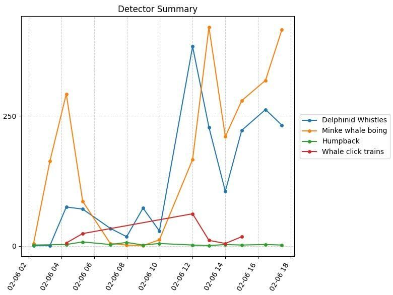{fig-alt="Real time detections provided by JASCO OceanObserver (on a Slocum Glider) during a window of several days."}

:::

::: {.column width="30%"}

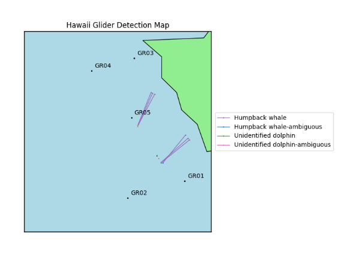

:::

::: {.column width="30%"}

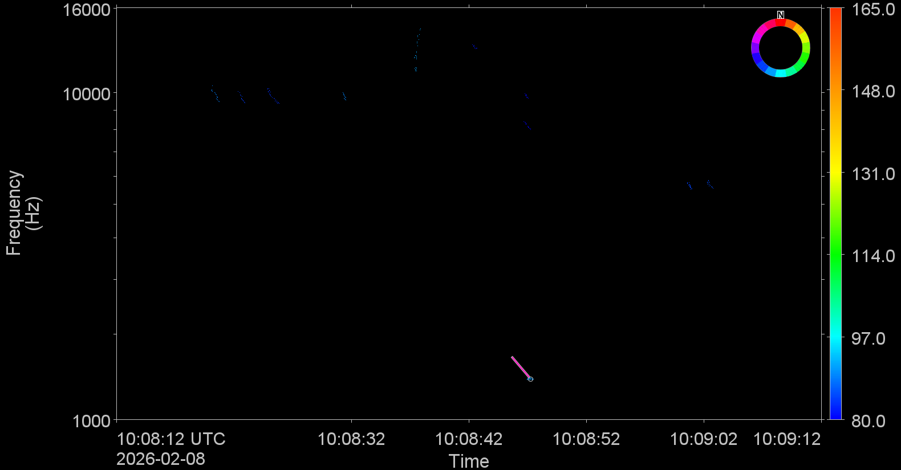

:::

:::

::: columns
::: {.column width="30%"}

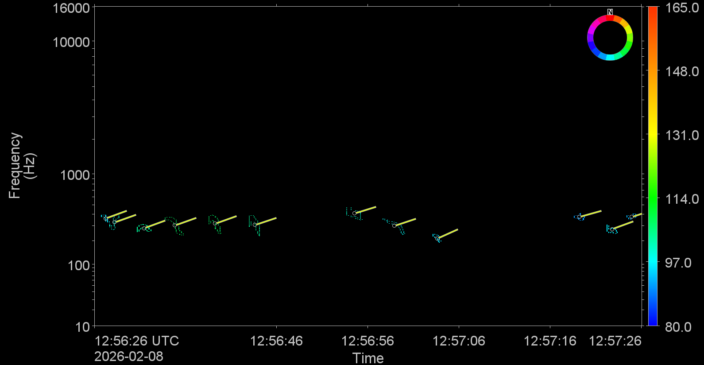

:::

::: {.column width="30%"}

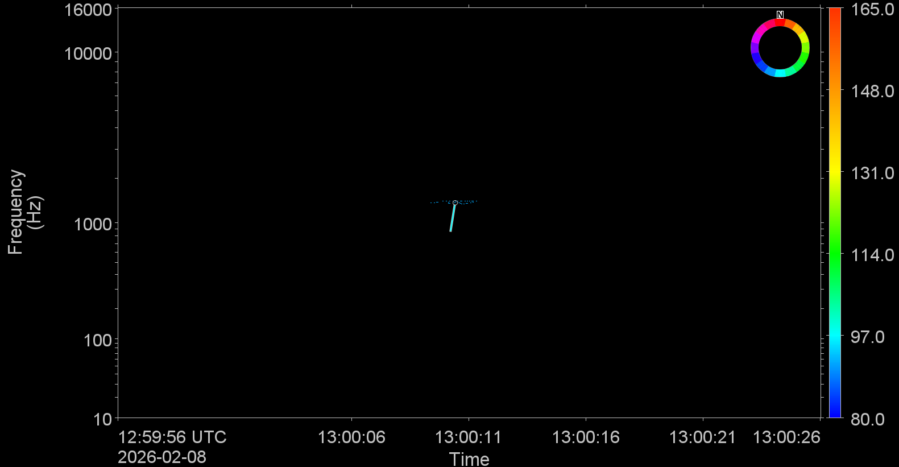

:::

::: {.column width="30%"}

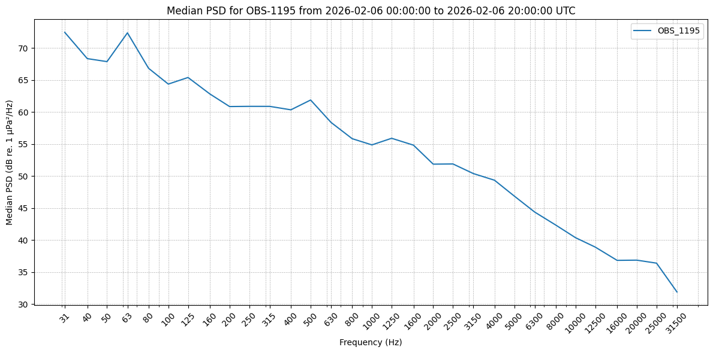

:::
:::

#### *Alseamar Ocean Explorer*

Pre-defined algorithms provided an opportunity for real-time detection of dolphins, humpback whales, sperm whales, and fin whales. In addition to detections, low resolution spectrograms could be automatically sent from the glider in near real-time.

::::: columns
::: {.column width="40%"}
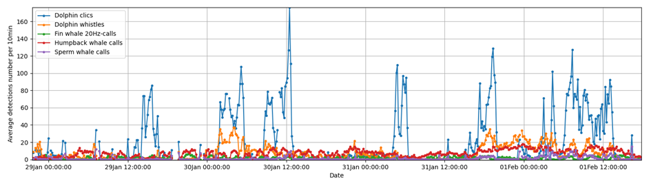
:::

::: {.column width="40%"}
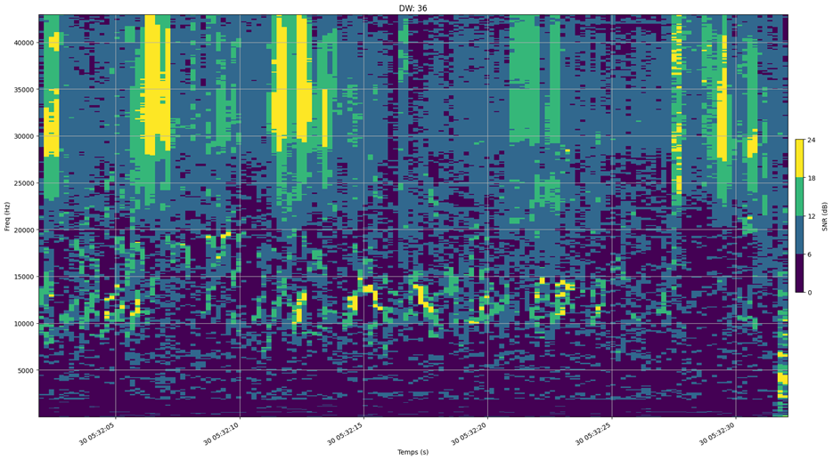
:::
:::::

::::: columns
::: {.column width="40%"}
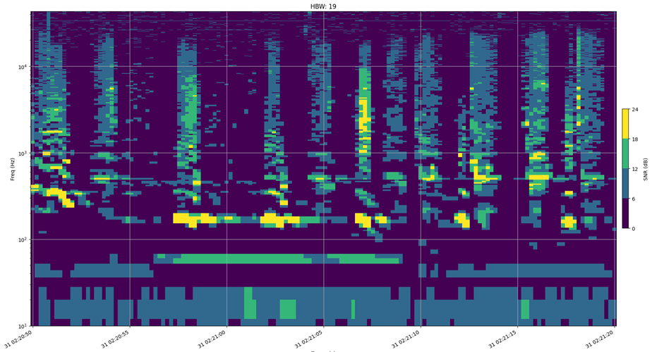
:::

::: {.column width="40%"}
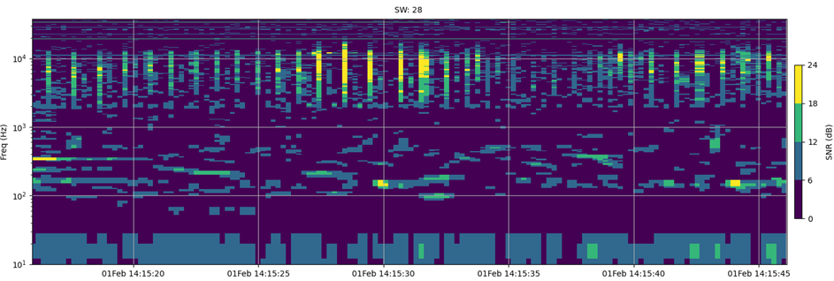
:::
:::::

The Alseamar SeaExplorer also provided near real-time plots of ambient noise measurements. Ambient noise measurements from early in the sea trial showed very low levels of low frequency ambient noise (near the theoretical minimum). These visualizations also provided information on detection of ship noise (and ship crossings), humpback whale chorus, and low frequency flow noise during fast (glider) travel. An increase in ambient noise associated with increasing sea states could be detected in the longer term LTSA shown by dive sequence.

::::: columns
::: {.column width="40%"}
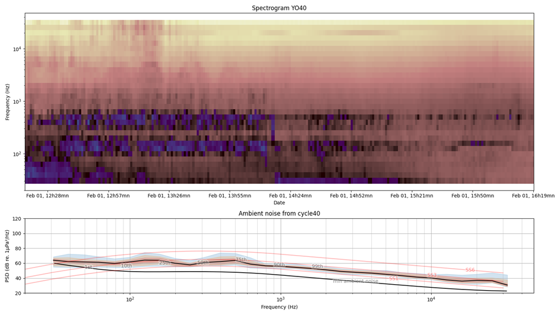
:::

::: {.column width="40%"}
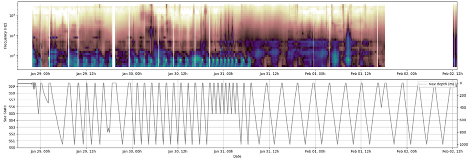
:::
:::::

#### *Hefring OceanScout*

*Stay Tuned!*
