```{r fieldwork prep}
#| echo: false
#| include: false
library(here)
source(here::here("_code/_common.R"))
here()

```

## Partners

::: {.callout-note collapse="true" appearance="simple" icon="false"}
#### *Pacific Islands Fisheries Science Center*

[*Pacific Islands Fisheries Science Center*](https://www.fisheries.noaa.gov/pacific-islands/population-assessments/passive-acoustics-pacific-islands) was the lead on all Glider Rodeo field efforts and co-lead of the PAM-Glider Strategic Initiative.
:::

::: {.callout-note collapse="true" appearance="simple" icon="false"}
#### *Southwest Fisheries Science Center*

[*Southwest Fisheries Science Center*](https://www.fisheries.noaa.gov/west-coast/science-data/southwest-acoustic-ecology-lab) assisted with the Glider Rodeo event and co-leads the PAM-Glider Strategic Initiative.
:::


::: {.callout-note collapse="true" appearance="simple" icon="false"}
#### *Oregon State University, CIMERS and MMI*

The Cooperative Institute for Marine and Ecosystem Resources Studies (CIMERS) and Marine Mammal Institute (MMI) at Oregon State University are world leaders in marine mammal and bioacoustics research.

They were involved in some of the earliest development to use gliders for marine mammal passive acoustic research and have conducted glider missions in many ocean basins for the U.S. Navy, BOEM, and NOAA.

Participants: [Selene Fregosi](selene.fregosi@noaa.gov), [Dave Mellinger](dave.mellinger@noaa.gov)
:::

::: {.callout-note collapse="true" appearance="simple" icon="false"}
#### *Cornell University*

K. Lisa Yang Center for Conservation Bioacoustics provided Hefring OceanScout gliders.

Participants: [Maria Vasilkin](mv478@cornell.edu)
:::

::: {.callout-note collapse="true" appearance="simple" icon="false"}
#### *Teledyne Webb Research*

Teledyne Webb Research, in conjunction with JASCO Applied Sciences, provide a Slocum glider equipped with a JASCO OceanObserver acoustic sensor.

Participants:[Karl Boettger](karl.boettger@teledyne.com), [Shea Quinn](Shea.Quinn@teledyne.com), [Cordie Goodrich](cordielyn.goodrich@teledyne.com)
:::

::: {.callout-note collapse="true" appearance="simple" icon="false"}
#### *Alseamar*

Alseamar provided an Alseamar SeaExplorer glider outfitted with an Auris acoustic sensor.

Participants: [Camille Pierini](cpierini@alseamar-alcen.com), [Laurent Beguery](LBEGUERY@alseamar-alcen.com)
:::

::: {.callout-note collapse="true" appearance="simple" icon="false"}
#### *JASCO Applied Science*

JASCO Applied Sciences, in conjunction with Teledyne Webb Research, provided a JASCO OceanObserver acoustic sensor on a Slocum.
:::

::: {.callout-note collapse="true" appearance="simple" icon="false"}
#### *University of Hawaii Marine Center*

Special thanks to [UH Marine Center](https://www.soest.hawaii.edu/UHMC/) for providing charter vessel support
:::

## Survey Design

Survey design consisted of a series of tracklines in a 'Figure 8' pattern, with each trackline serving as a different phase with its own mission goals. The goal was to reduce trimming changes in the middle of a phase (after initial trimming) to reduce covariates in our analysis. There was no attempt to keep the gliders together in any given phase; our intention was to allow gliders to operate as if they were doing a solo survey.

::: columns
::: {.column width="50%"}
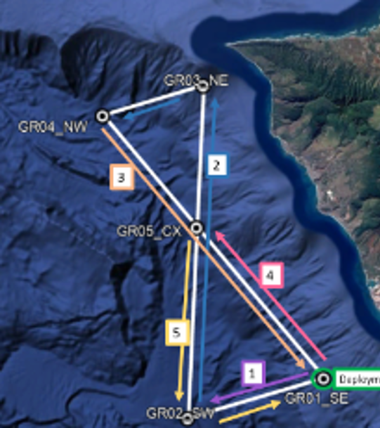
:::
::: {.column width="50%"}

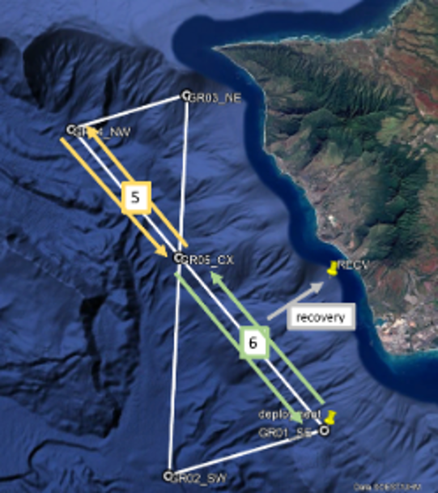
:::
:::

### Phase 1: Trimming
*Fine Tune Adjustments*
Glider deployment to take place near location SW (will take several hour). All teams were directed to send their gliders to waypoint GR02 (SW corner) while they do any initial trimming and assessments. This distance was 18 km and was intended to take the remainder of the day. Pilots were instructed to hold their glidres near GR02 until ~ 1200 HST on 29 January 2026. 

### Phase 2: FAST Mission Mode
*Pilot to prioritize trackline progression*
Goal is to fly gliders with goals of making good progress against currents and along the trackline and staying near the trackline, without worrying about glider motor noises or flow noise. 

Safety of the glider is the priority. GR03 is in shallower water (~600 m depth) so intention was to reduce maximum dive depths at the same point during the approach to GR03: decrease dive depth to 500 m before reaching 6 km to go to GR03 (water depth at 6 km to go is 1100 m). Intention was to increase dive depth after transiting 5 km from GR03 on way to GR04 (water depth at 5 km past is 1300+ m). 

### Phase 3: SLOW Mission Mode
*Pilot to minimize niose while reaching the end of the line*
Goal is to fly gliders with the goal of quiet acoustic data - reduced speed and guidance and control adjustments to reduce flow noise motor sounds. Making progress along the trackline is not the priority, within reason - we don’t want a glider wandering somewhere far away but are ok if it makes slower progress against currents. 

### Phase 4: INTERMEDIATE Mission Mode
*Balancing maintaining course with reduced self-noise*
Goal is balance of progress along trackline and maintaining course with reduction in glider-generated sounds or flow noise as possible. This is expected to be typical of what would be used for a PAM mission. 

### Phase 5: Drift Mission Mode
*Intermediate mode with 20 min drifts at 800 m (repeated)*
Goal is to fly gliders using the same general settings as intermediate phase, but add in drift at depth 800 m for 20 min duration (Oceanscout will drift at 150-180 m). It was decided that gliders could conduct a few dives within the first hour to first tune the drift settings/ballast. Intention was for a few 20 mins drift to understand glider movement over that duration of time.

### Phase 6: Mini-Rodeo
*Cycle through Phase 2-5 (12 hrs each)*
To accommodate data storage problems with one glider, we conducted a 'mini-rodeo' to have all gliders cycle through the 4 phases one more time (12 hours each) before recovery. This began after the last 12 hours of drift mode and included: Slow, Intermediate, and Fast phases. Rather than target waypoints for the switches, transit along the NW to SE transect line as needed and switch at the specified times. Switch modes at your first surfacing after the 12 hour counter using the following:

Sat 2000 HST - Last 12 hours of DRIFT mode (Phase 5)
Sun 0800 HST - Start SLOW mode
Sun 2000 HST - Start INTERMEDIATE mode 
Mon 0800 HST - Start FAST mode
Mon 2000 HST - proceed to recovery - fly as you need to get as close as possible to recovery location

### Phase 7: Recovery 

::: columns
::: {.column width="50%"}
```{r waypointsTable}
#| echo: false

waypointsTable <- read.csv(here("data/waypoints.csv"))

waypointsTable %>%
  DT::datatable(
    caption = "Trackline Waypoints used during PAM-Glider Rodeo",
    filter = "top"
  )

```
:::

::: {.column width="50%"}
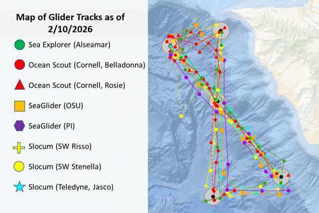
:::
:::


## Communications

PIFSC/SWFSC communication teams facilitated the creating and amplification of a series of integrated outreach/communications events that highlight how we are assessing capabilities of various passive acoustic glider systems to inform a transition to operations. These efforts were outlined in a Communications and Outreach plan developed by PIFSC ([Stefanie Gutierrez](stefanie.gutierrez@noaa.gov)) and SWFSC ([Sarah Mesnick](sarah.mesnick@noaa.gov)).

*Communications included:*

February 5, 2026 - NOAA Featured Web Story: [NOAA Fisheries Launches Underwater Glider Challenge in Hawai‘i](https://www.fisheries.noaa.gov/feature-story/noaa-fisheries-launches-underwater-glider-challenge-hawaii) (Stefanie Gutierrez)  
February 5, 2026 - Sound Bytes Blog: [Meet the Pilots of the Underwater Glider Challenge](https://www.fisheries.noaa.gov/science-blog/sound-bytes-meet-pilots-underwater-glider-challenge) (Kourtney Burger)  
March 30, 2026 - Sound Bytes Blog: [Synchronous Swimming (with Robots) - Behind the Glider Challenge](https://www.fisheries.noaa.gov/science-blog/sound-bytes-synchronous-swimming-robots-behind-glider-challenge) (Selene Fregosi)  

## Data Offload

Hefring Ocean Scout, Alseamar SeaExplorer: Data were offloaded at the end of the Glider Rodeo prior to shipping the gliders.

At the end of the Glider Rodeo, the Seagliders started a mission with additional tracklines and for an additional 8-10 weeks associated with the WHICEAS survey, and data was downloaded when these gliders returned from their second mission.

Slocum: Data download from the Slocum requires access to the internal acoustic module and was conducted after the glider returned to its home port (La Jolla, CA).

## Field Reports

Brief summaries were provided for the SWFSC Weekly Reports during the Glider Rodeo fieldwork ([Feb 2,](https://drive.google.com/file/d/1ef5zI-_UE4WJwWlxOpZdEz625DopJ44u/view?usp=drivesdk) [Feb 9](https://drive.google.com/file/d/1w-aB2o7pMtN3jAHkogazJ11-pYViMWFv/view?usp=drivesdk), [Feb17](https://drive.google.com/file/d/1LPmR2GF-eWiwqoa6sY0LExupUPDJEG0K/view?usp=drivesdk), in addition to [NOAA Webstory and Blogs](https://nmfs-pam-glider.github.io/GliderRodeo/content/data-collection.html#communications)).

**Pilot Logs:** can be found in the 📂supplement/pilotLogs/ folder in the GliderRodeo github repository.

Each glider platform provides a different approach to real-time summaries:

#### *Hefring OceanScout*

*Stay Tuned!*

#### *Seaglider*

*Stay Tuned!*

#### *DMON on Slocum Glider*

*Stay Tuned!*

#### *WISPR on Slocum Glider*

*Stay Tuned!*

#### *JASCO OceanObserver on Slocum Glider*

Pre-defined algorithims provided an opportunity for real-time detection of dolphins, minke whales, and humpback whales.

<details>

<summary>Click to expand full details</summary>

:::::: columns
::: {.column width="30%"}
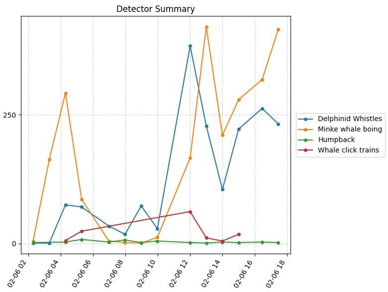{fig-alt="Real time detections provided by JASCO OceanObserver (on a Slocum Glider) during a window of several days."}
:::

::: {.column width="30%"}
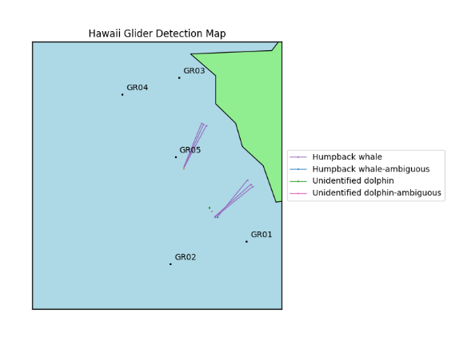
:::

::: {.column width="30%"}
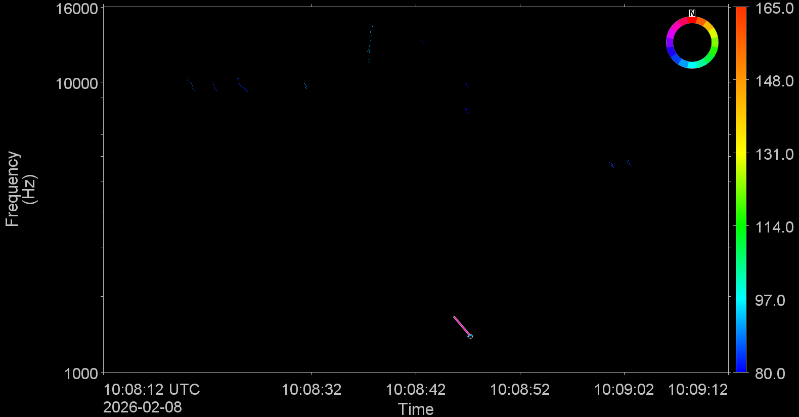
:::
::::::

:::::: columns
::: {.column width="30%"}
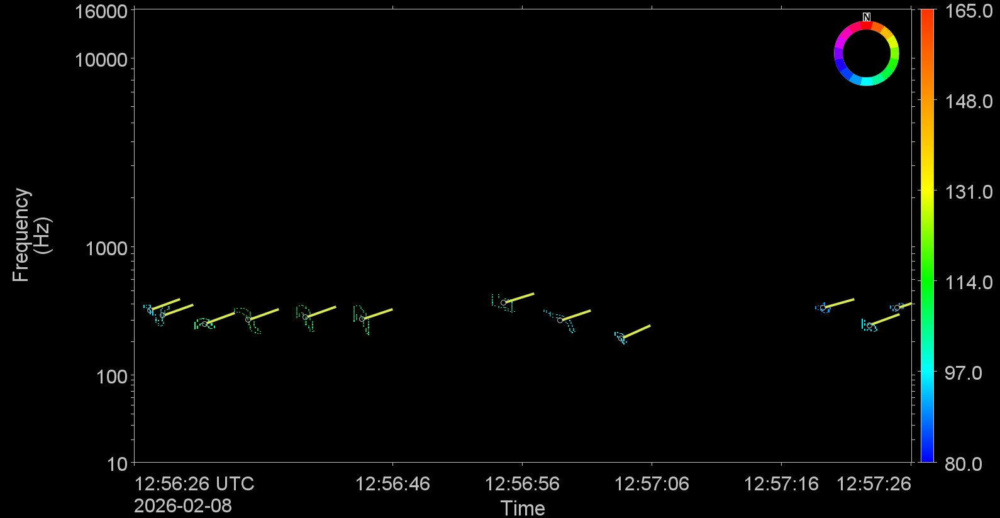
:::

::: {.column width="30%"}
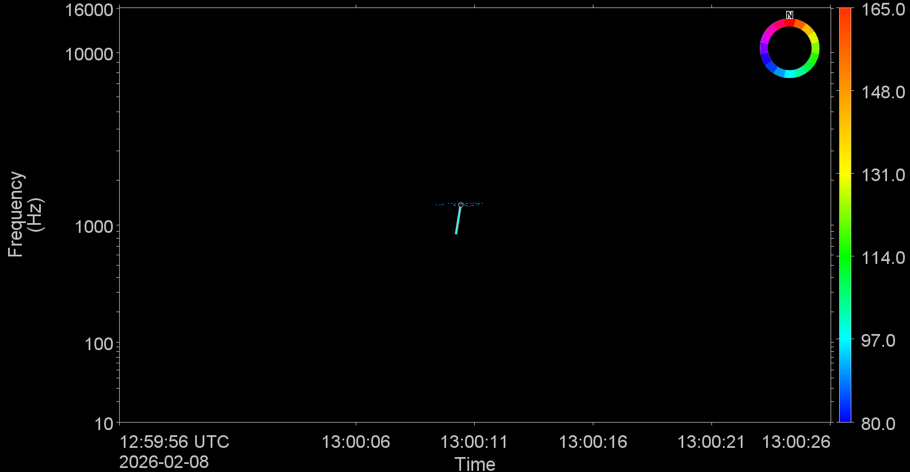
:::

::: {.column width="30%"}
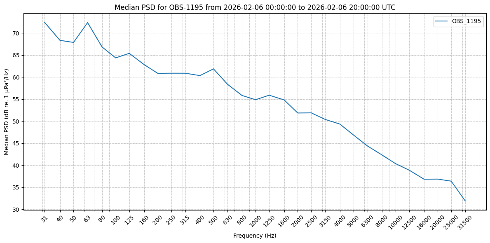
:::
::::::

</details>

#### *Alseamar Ocean Explorer*

Pre-defined algorithms provided an opportunity for real-time detection of dolphins, humpback whales, sperm whales, and fin whales. In addition to detections, low resolution spectrograms could be automatically sent from the glider in near real-time.

<details>

<summary>Click to expand full details</summary>

::::: columns
::: {.column width="40%"}
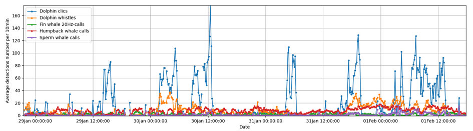
:::

::: {.column width="40%"}
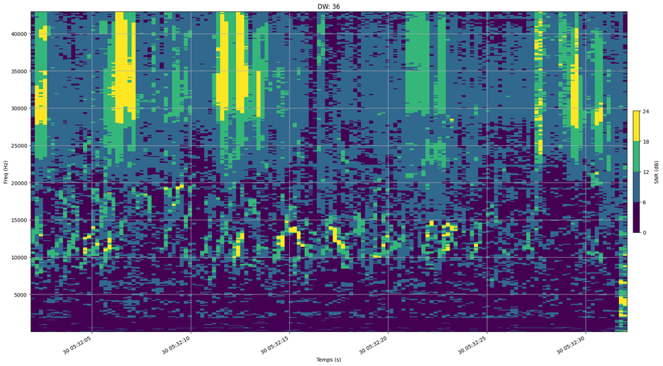
:::
:::::

::::: columns
::: {.column width="40%"}
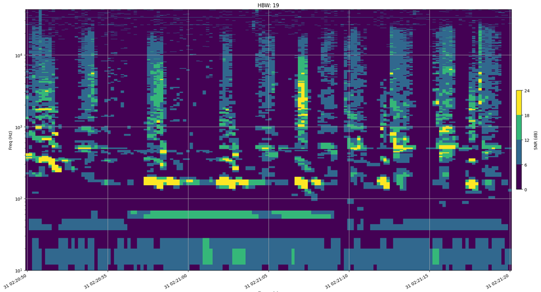
:::

::: {.column width="40%"}
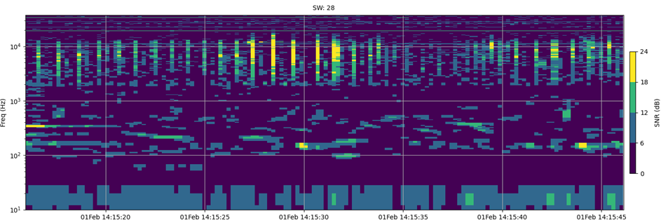
:::
:::::

The Alseamar SeaExplorer also provided near real-time plots of ambient noise measurements. Ambient noise measurements from early in the sea trial showed very low levels of low frequency ambient noise (near the theoretical minimum). These visualizations also provided information on detection of ship noise (and ship crossings), humpback whale chorus, and low frequency flow noise during fast (glider) travel. An increase in ambient noise associated with increasing sea states could be detected in the longer term LTSA shown by dive sequence.

::::: columns
::: {.column width="40%"}
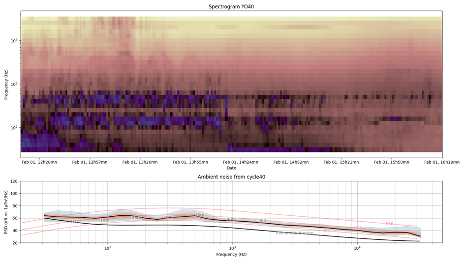
:::

::: {.column width="40%"}
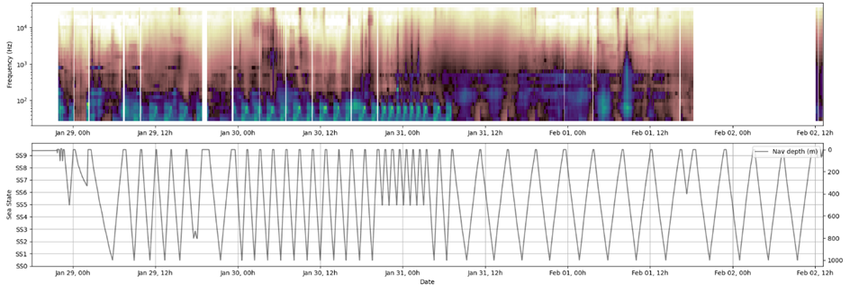
:::
:::::

<details>
