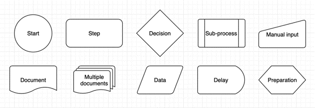
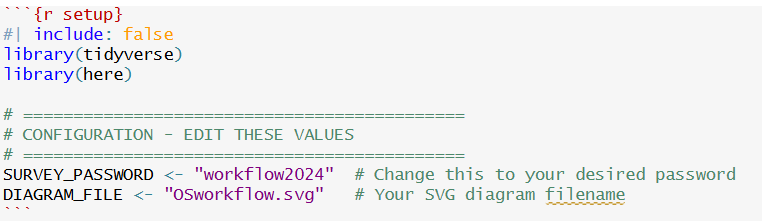

## Build a Flowchart in draw.io

*(If you did not yet build one)*

1.  Go to [app.diagrams.net](https://app.diagrams.net/) to initiate your draw.io flowchart.

2.  Make a draft flowchart. Draw.io is very intuitive, but if you need help, see resources at the bottom of this page.

3.  Export As –\> SVG –\> Device (in my experience, I cannot navigate the 'save as' to my folder of interest. So, you will need to save to your downloads folder, and then in File Explorer, save to the outputs/ folder of your Repository.

## Modify Flowchart in draw.io

1.  Open app.diagrams.net in your web browser

2.  File –\> Open From –\> Device and navigate to open your diagram in your repository output folder

3.  You can create sub-pages for different components of your Flowchart (the auto-build may have done this for you). Note that changes made to one page are not reflected on other pages.

4.  Modify your chart in draw.io, considering using these conventions:

    

## Customize your Pathways Flowchart Tool

Now that your diagram is ready and saved to your 'output' folder, you need to modify the tool so it can find your diagram.

1.  Open your project in Rstudio

2.  Open the 'flowchart-pathways.qmd' in the content/ folder

3.  scroll to the \# Configuration. Modify the SURVEY_PASSWORD (if you choose), and give the name of your DIAGRAM_FILE (and ensure this file is in the output/ folder!)

-   Save the file
-   Check that it works by:
    -   Open the index.qmd (in your root directory), and click 'Render'
    -   Go to the Terminal (bottom left in RStudio), and type 'quarto preview'

::: callout-Note
## Note:

The Flowchart tool is in html, and to view locally you will need to 'preview' quarto as html. If it looks good here, then it should render correctly as html in the github pages
:::

## Resources

[Draw.io Tutorials](https://drawio-app.com/tutorials/)

[Draw.io Documentation](https://www.drawio.com/doc/)

[Draw.io Examples and Templates](https://www.drawio.com/example-diagrams)
