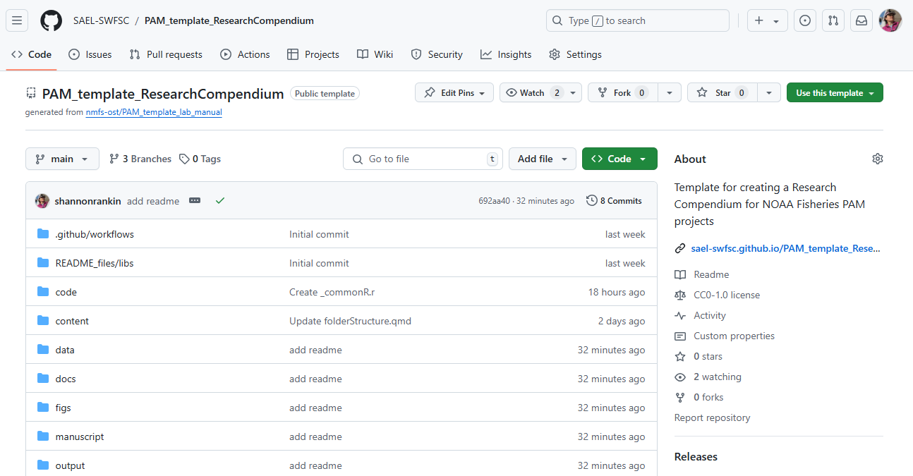
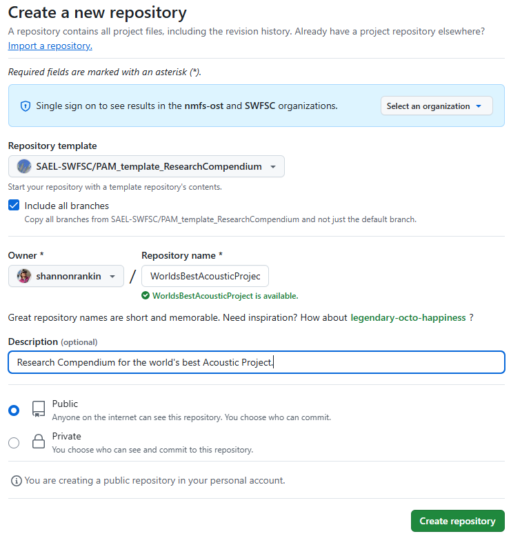
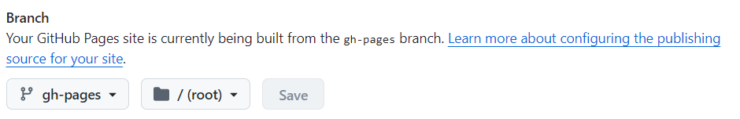
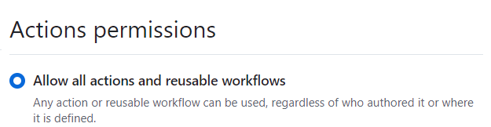
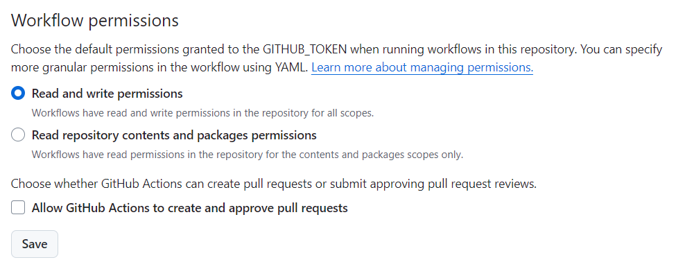
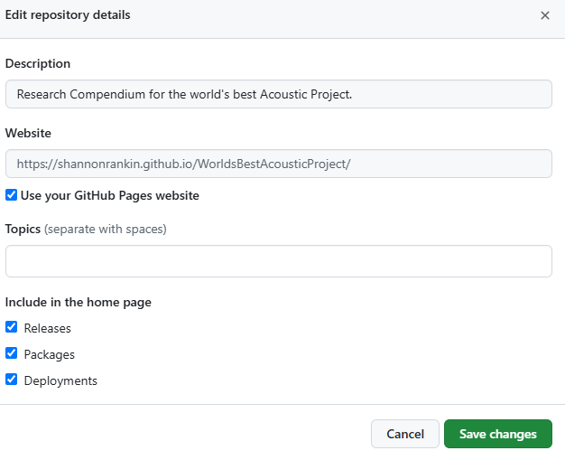

## How To Use This Template

This template will create a Github Repository standard folders and embedded flowcharts and the foundation for a Quarto website that can serve as a tool for navigating your Openscapes Pathways, a Lab Manual with embedded flowcharts, or as an experimental repository. 

Follow the steps below to copy this template to your lab's GitHub

1.  Open [this repository on GitHub]

2.  Click on the 'Use this template' button in the top right, select 'Create new repository'

    

3.  Edit repository settings

    -   Select the 'Include all branches' option

    -   Select your lab organization or yourself as the owner and set the repository name to your ***Project Name***

    -   Make description "Research Compendium for ***Project Name***"

    -   Make the repo public

        

4.  Click create repository

5.  Turn on GitHub pages under Settings-\>Pages. You will set pages to be made from the gh-pages branch and root directory

    

6.  Update 'Actions' settings

    -   Under Settings -\> Actions -\> General -\> Actions permissions select 'Allow all actions and reusable workflows'. Select save

        {width="323"}

    -   Under Settings -\> Actions -\> General -\> Workflow permissions select 'Read and write permissions'

        

        ::: callout-important
        ## Note: Both of these settings may already be selected but you have to click save for both
        :::

7.  Return to the main page of the repo to edit your website

    -   Click on 'Code' in the top left

    -   Click on the settings button next to the 'About' section on the right side of the repository

    -   Select 'Use your GitHub Pages website'. This should autopopulate the website

    -   Select 'Save Changes'

        

8.  The foundation for your project is now created! We recommend that you first modify the ReadMe to add your Project Name in the appropriate places. 

