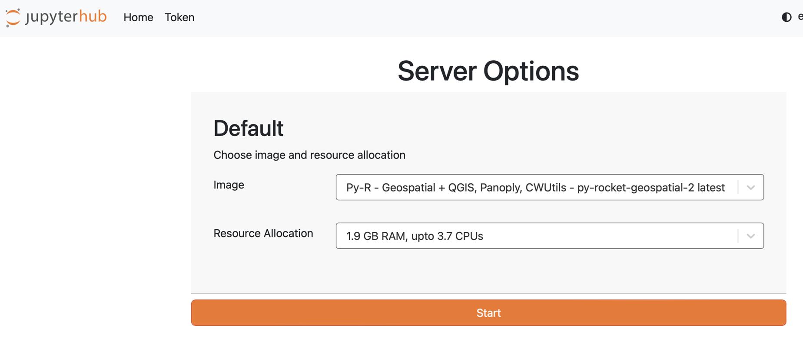
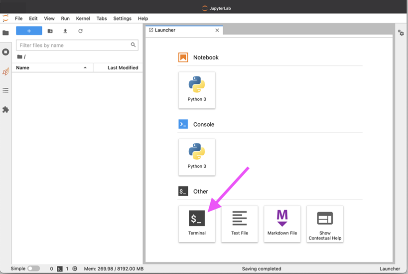
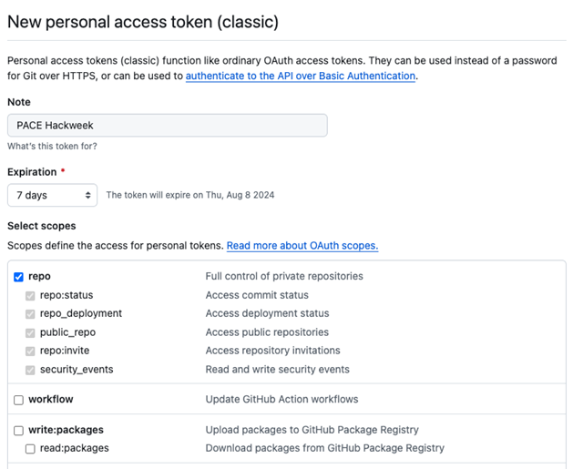

# What to Expect

The PAM-Glider Rodeo Hackweek will focus on applied, hands-on learning, with participants engaging in extended periods of small-group work. Our tutorials are designed to offer a broad snapshot of our data and science tools to support your applied investigations. Due to the relatively short duration of our events, we are not able to provide comprehensive, in-depth training in fundamental tools. Rather, our goal is to inform you about the types of tools we think are best suited to working with the glider and PAM datasets. The details of implementation will be what you work out via peer-learning (helping each other) in your project group.

Typical Workflows and Tools Here are a few specific scenarios of how hackweek participants will engage with data science tools:

- Connecting to a Jupyter Notebook environment and accessing content for tutorial training.

- Accessing cloud-hosted remote sensing data using earthaccess and plotting it using matplotlib.

- Exploring multi-dimensional remote sensing data using xarray.

- Opening CSV tabular data in Pandas and run tools to conduct satellite matchups.

- Modifying code, committing it to Git and pushing changes to GitHub, for others on your team to view and edit.

- Exploring methods for high performance computing such as using Dask and parallelization

- Preparing datasets for machine learning tools, including PyTorch and TensorFlow for neural networks

These are examples of the types of activities we will do at the PAM-Glider Rodeo hackweek in a collaborative setting. Be aware that most of the project work will be within self-organized project teams. Much of the hackweek will be spent running code (via notebooks), writing code and talking about code. The mentors and organizers will provide links to tutorials and help trouble-shoot code, but much of the learning comes from working on a project together.

All tutorials will be in Python using the Pangeo ecosystem of tools for computing in the earth sciences. For participants wishing to brush up on their skills before the event, we recommend viewing the resources as described on the Pythia Foundations website. Teams are welcome to do their project in R and our compute platform fully supports R for earth science computation. The HackWeek mentors/helpers are experienced in Python, R and Matlab.

## HackWeek Projects

A good hackweek project is a concrete idea that a team can flesh out in a week together. Not everyone needs to code. There is background research to do, data to find, and lots and lots of data wangling. A big part of the fun of hackweek is working together with a group with a diverse set of interests and skills. “I’ll find some data.” “I make some maps of our study area.” “I’ll figure out how to do a boosted regression tree.” “I’ll use that tutorial we were shown and get xyz glider data for our region.” etc, etc. It is messy, but through this process you’ll learn new skills and also get to know your project team mates.

The project work is a combination of

- fleshing out a science idea that is small enough on Monday brainstorming.

- dividing up into tasks so that everyone can participate.

- coding and data wrangling on Tuesday through Thursday.

- and then Friday, frantically putting a presentation on your project and results.

# Checklist

::: callout-important
## Attention!

Here is a checklist of things you need to do in advance: - \[ \] Create a Github Account - \[ \] Login to the JupyterHub - \[ \] Review material on the Resource Book linked on the website
:::

## Github Account

[GitHub](https://github.com/) enables us to collaborate on code across teams in a web environment. If you do not already have a GitHub account, then navigate to [GitHub](https://github.com/), enter your email address and click on the green ‘Sign up for GitHub’ button. Be sure to save your username and password somewhere for use during the hackweek.

## Hackweek JupyterHub

We will be using a pre-provisioned compute environment for the hackweek which can be accessed via a web browser. You will not need to install anything. Please follow these instructions which will guide you through gaining access to the JupyterHub.

[Watch this video](https://youtu.be/uZ2Uy376Az8) to get an orientation on our JupyterHub.

Sign in by navigating to the JupyterHub. Instructions to sign in are in our Slack channel here.

You will see server options. To start, you can stay with the default image and RAM. It can take several minutes for new servers to launch on the cloud. Once things are spun up, you will see your very own instance of a JupyterLab environment.



You will have access to your own virtual drive space under the /home/jovyan directory. No other users will be able to see or access your data files. You can add/remove/edit files in your virtual drive space. You will also have access to the shared-public folder (read and write access). These are shared spaces so please make sure not to delete files from here unless they are yours.

To save our community money, when you are finished working for the day it is helpful for you to explicitly stop your server before logging out of your JupyterHub session. To shut your server down immediately when you’re exiting your session please select “File -\> Hub Control Panel -\> Stop my Server” then you can click the “Log Out” button. We ask this because when you keep a session active it uses up AWS resources and these resources cost money per hour of use. If you forget this step, though, the server will shut down automatically after 90 min of no use. Logging out will NOT cause any files under your home directory to be deleted. It is equivalent to turning off your desktop computer at the end of the day.

## Pre-HackWeek Learning (Optional)

If interested, please review course material from prior events:

How do I run the tutorials if I don’t have Python and all the packages installed? Once you are in the Github Rodeo Hackweek slack, we’ll provide a link to our workshop compute environment (a JupyterHub). However, you can run 95% of the tutorials in [Colab](https://colab.research.google.com/). Here is a nice [intro to Colab for complete beginners](https://www.youtube.com/watch?v=Xi9-W26cDBs).

# Setting up **`git`**

## What is Git?

[Git](https://git-scm.com/) is a version control system that many scientists use to collaborate on code.

::: callout-note
You are not required to know Git in advance of this event, but this is a great opportunity to learn all about it! [Here’s a quick introduction video from the official website](https://git-scm.com/video/what-is-git)
:::

## Setting up on JupyterHub

Below are instructions to get you setup with `git` on the PAM-Glider Rodeo Hackweek JupyterHub. These are only basic instructions to get started. See the [Software Carpentry Git](#0){style="font-size: 11pt;"} instructions for a thorough explanation and background information.

1.  Login to JupyterHub

    Go to [https://nmfs-openscapes.2i2c.cloud](https://nmfs-openscapes.2i2c.cloud/). See also our JupyterHub documentation: accessing-jupyterhub

2.  Open a Terminal

    Choose the “Terminal” app from the “Other” options in the Launcher.

    

3.  Configure Basic `git` Information

    Set your name and email address. The `user.name` is your full name, not your “username” on GitHub or anywhere else. The email address should be one registered on your GitHub account.

::: callout-important
## Attention

Use your own name instead of the placeholder Attendee Name in the below commands. For the email, it should be the address you used to create your GitHub account instead of attendee\@hackweek.com. Both values need to be surrounded by quotes ".
:::

```{r}
#| eval: false
$ git config --global user.name "Attendee Name"
$ git config --global user.email "attendee@hackweek.com"
$ git config --global pull.rebase true
```

The third line is a configuration you must set before pulling with git. It specifies the strategy on how git will apply changes you pull from a remote git repository. More on strategies is [described here](http://git-scm.com/book/en/v2/Git-Branching-Rebasing).

To verify that you successfully executed the above commands, use the git config --list command in the Terminal. The output should look similar to this:

```{r}
#| eval: false
$ git config --list
user.name=Attendee Name
user.email=attendee@hackweek.com
pull.rebase=true
```

4.  Authenticating with Github In order to interact with GitHub via the git command inside the JupyterHub environment, you need to set up authentication. The two methods below both rely on secure Personal Access Tokens, which you can learn more about on [GitHub docs](https://docs.github.com/en/authentication/keeping-your-account-and-data-secure/managing-your-personal-access-tokens).

Option 1: gh-scoped-creds We recommend this method if you have permission to configure a GitHub App on the user or organization where you need to authenticate. For the hackweek, we have pre-configured permissions so that you can push to fish-pace.

Start from a Terminal (choose the “Terminal” app from the “Other” options in the Launcher). Follow the instructions returned by the gh-scoped-creds command:

```{r}
#| eval: false
$ gh-scoped-creds 
You have 15 minutes to go to https://github.com/login/device and enter the code: XXXX-XXXX
Waiting......
```

After you have entered the code and granted authorization, the Terminal will update:

```{r}
#| eval: false
Success! Authentication will expire in 8.0 hours.

Visit https://github.com/apps/cryocloud-github-access to manage list of repositories you can push to from this location
Tip: Use https:// URLs to clone and push to repos, not ssh URLs!
```

If you need to push to repositories that are not in Glider-Rode, such as to repos in your personal GitHub account, you will need to set up permission to access those repos. Follow the link provided. Here is a GIF walking through the workflow. Note that it shows a way to do the same setup in a notebook before showing the Terminal way just described.


Option 2: Manual Configuration Work through the instructions on the [GitHub personal access tokens](https://docs.github.com/en/authentication/keeping-your-account-and-data-secure/managing-your-personal-access-tokens#creating-a-personal-access-token-classic) page. The maximum permissions you likely need is the repo scope.



Once you have created your token, be sure to save it or use it before navigating away. It won’t be visible again. To have it saved on the JupyterHub the first time you use it, configure the git credential helper.

```{r}
#| eval: false
git config --global credential.helper store
```

To use the Personal Access Token, you need to use git to do something that requires authentication, such as pushing to a repository or cloning a private repository. These actions will prompt for input of your credentials. When prompted for a password, use the Personal Access Token rather than your GitHub password.

::: callout-important
The prompt for the Password: will not show any characters that are entered and stay blank. Make sure to only copy and paste your token once and then hit the enter key.
:::

# Getting started with Python

For those of you who want to learn scientific programming with Python, here is one path you can follow.

## Log into the hackweek JupyterHub

```{r}
#| eval: false
workshop.nmfs-openscapes.2i2c.cloud
```

Watch this [video](https://youtu.be/uZ2Uy376Az8?si=Nh3simSYe94c0eEB) for a quick orientation to the JupyterHub.

## For those who are brand new to Python

You might want to start with this basic [Software Carpentries Python](https://swcarpentry.github.io/python-novice-inflammation/index.html) course.

- Log into the JupyterHub

- Open and new Jupyter notebook

- Enter code from the course and run

## Start with some basic tutorials

Watch a [video](https://youtu.be/scNDbOKZB4A) to see Eli doing these instructions.

These are by [Robert Johansson](https://jrjohansson.github.io/) author of Numerical Python.

- Log into the JupyterHub

- Open a terminal.

- Type

```{r}
#| eval: false
cd ~
git clone https://github.com/jrjohansson/scientific-python-lectures
```

Open the ipynb notebooks and start working through the material.
