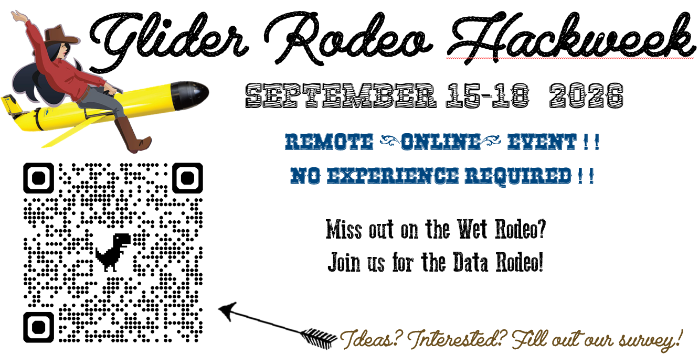

## Objective

Our goal is to develop open-source analysis and visualization tools that evaluate glider performance during the Glider Rodeo, providing the community with a standardized framework for future data integration. By collaborating on these methods, we aim to strengthen professional networks and foster hands-on learning that advances the collective expertise of the glider community.

## Goals

We have a suite of initial goals for this community hackathon:

- Assess different piloting approaches to identify impacts on critical components (navigation, endurance, noise) and identify a set or recommendations or 'best practices'.

- Assess variation in navigation capabilities for each glider in different conditions and during different mission modes.

- Assess impact of mission modes on battery endurance and PAM data storage.

- Assess impact of self noise (and variation in self noise under different conditions) and the impact of this noise on study objectives

- Assess variation in acoustic detection of target species for different platforms in different conditions.

## How to Participate

Do you have ideas, recommendations or advice for this event? Are you interested in participating?

Please fill out this [survey](https://forms.gle/y1kFU1U13iEbww2i9), and we'll reach out later in the summer.
