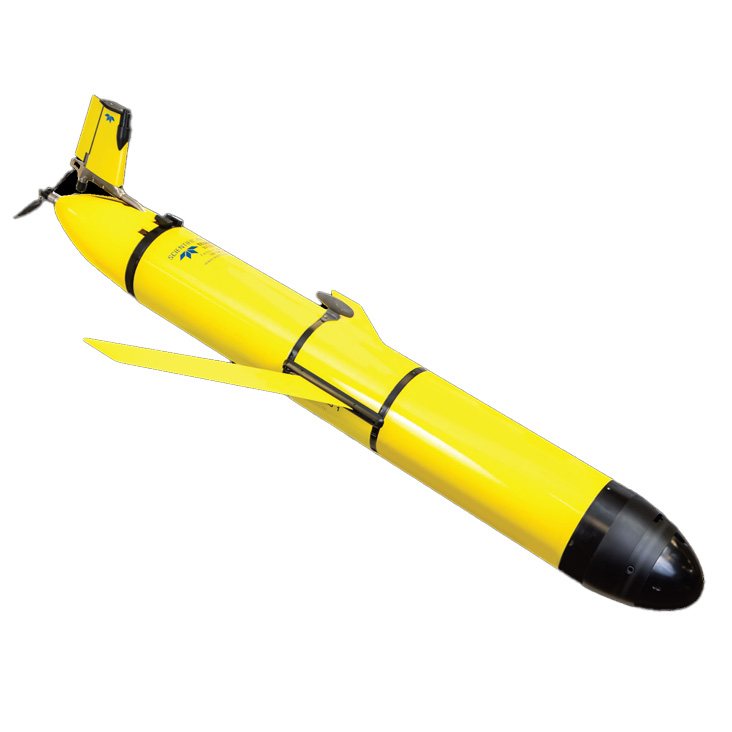
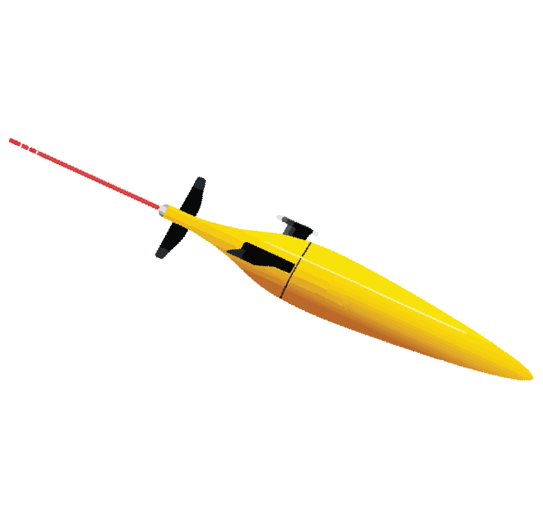
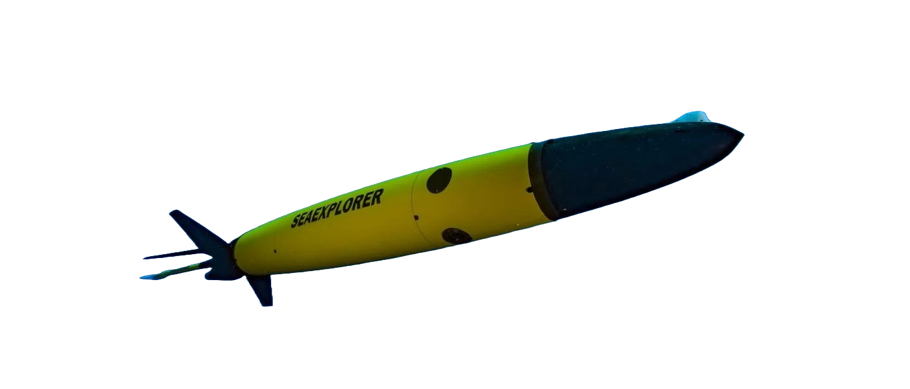
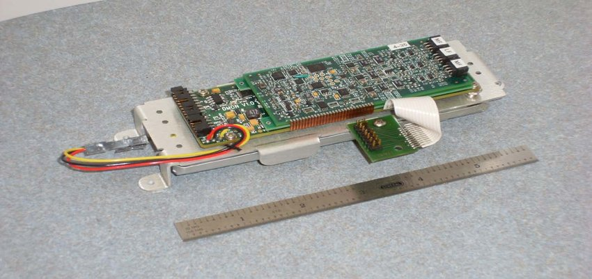
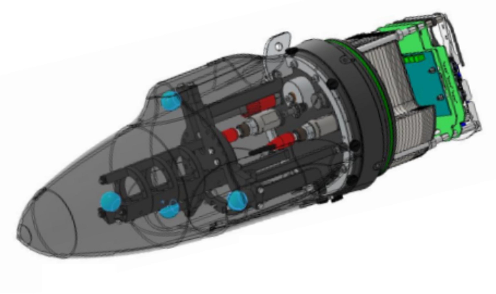
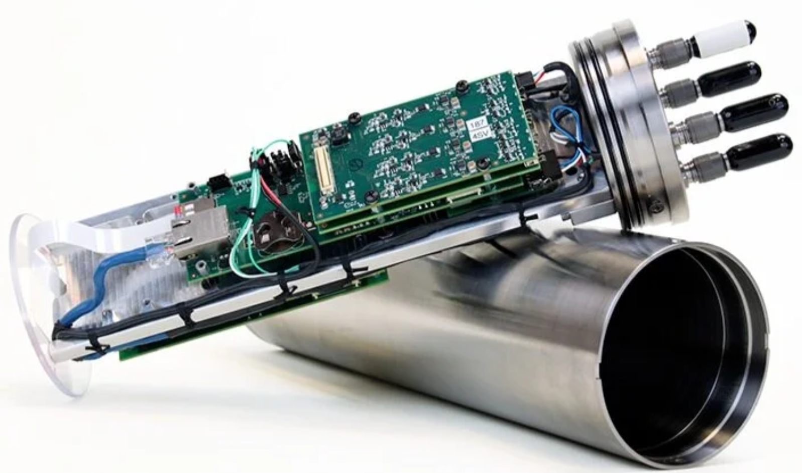

```{r hardware prep}
#| echo: false
#| include: false
library(here)
source(here::here("_code/_common.R"))
here()

```

# Acoustic Hardware

A total of 8 gliders from four different companies, with four different
PAM sensors, were included in the PAM-Glider Rodeo. A summary of the
platform specifications are provided in the table, below, and additional
details are provided for the Glider platforms, acoustic sensors, and
oceo sensors (below).

```{r gliderTable}
#| echo: false

gliderTable <- read.csv(here("data/PAM_Glider_Specs.csv"))

gliderTable %>%
  DT::datatable(
    caption = "List of Gliders used during PAM-Glider Rodeo",
    filter = "top"
  )

```

## Gliders

### Slocum Gliders (Teledyne Webb) {width="97"}

NOAA's Southwest Fisheries Science Center began deploying Slocum gliders
to study Antarctic krill in 2018, and in 2025 they will expand their
glider program with PAM-equipped gliders to study marine mammals off the
U.S. West coast. Slocum Gliders are modular, and three different PAM
systems will be tested: the
[DMON](https://apps.dtic.mil/sti/tr/pdf/ADA617025.pdf){target="_blank"}
(developed by WHOI) and
[WISPR](https://embeddedocean.com/passive-acoustics-2/){target="_blank"}
(Embedded Ocean Systems), and
[OceanObserver](https://static1.squarespace.com/static/52aa2773e4b0f29916f46675/t/6845b40f81c09d69d27e3a8e/1749398546414/OceanObserver+Slocum+Glider+Brochure.pdf)
((JASCO Applied Sciences)\[https://www.jasco.com/\].

### Seagliders (U Washington) {width="114"}

[Seagliders](https://iop.apl.washington.edu/seaglider.php){target="_blank"}
are buoyancy driven autonomous underwater vehicles developed at the
University of Washington. Through a partnership with Dave Mellinger at
Oregon State University, NOAA researchers at Pacific Islands Fisheries
Science Center has been testing the passive acoustic capabilities of
these gliders to conduct marine mammal monitoring off Hawaiʻi. They will
continue this collaboration in 2025 as PIFSC builds out their own glider
lab with Seagliders with onboard
[WISPR](https://embeddedocean.com/passive-acoustics-2/){target="_blank"}
acoustic processors. Seaglider support resources can be found
[here](https://iop.apl.washington.edu/iopsg/){target="_blank"} , and
WISPR 2.0 specifications can be found
[here](https://embeddedocean.com/wispr-v2-0/){target="_blank"} . *Note
that WISPR 3.0 is under development.*

### Oceanscout (Hefring) {width="149"}

The [Oceanscout](https://www.hefring.com/oceanscout){target="_blank"} is
a small glider developed as a 'user friendly' PAM-equipped glider. They
are much smaller and require less training and expertise to use.
Southwest Fisheries Science Center has procured two Oceanscouts for
testing and for specific scientific research efforts. The Oceanscout
specifications can be found
[here](https://cdn2.assets-servd.host/hefring-engineering/production/dist/assets/PDFs/combined-base-and-pam.pdf?dm=1707500641).

### SeaExplorer (Alseamar) {width="247"}

The
[SeaExplorer](https://www.alseamar-alcen.com/products/underwater-glider){target="_blank"}
was developed by the French company Alcen-Alseamar. Alseamar
SeaExplorers are not yet available for purchase in the United States,
but the company offers their gliders as a
[service](https://www.alseamar-alcen.com/services/marine-survey-services/underwater-gliders-services),
with mission planning, piloting, and data delivery. We will include
SeaExplorers in our Glider Rodeo (as a service). SeaExplorer
specifications can be found
[here](https://www.alseamar-alcen.com/sites/alseamar-alcen/files/products/pdf/ALSEAMAR-SEA_EXPLORER-2022-Web.pdf){target="_blank"}.

## Acoustic Sensors

Glider platforms can support one or more options for PAM sensors.
Technology is rapidly developing, and we will be testing the following
PAM Sensors:

::::: columns
::: {.column width="\"80%"}
## WISPR
:::

::: {.column width="\"20%"}
{width="100"}
:::
:::::

[WISPR](https://embeddedocean.com/passive-acoustics-2/){target="_blank"}
(Wideband Intelligent Signal Processor and Recorder) is an acoustic
processor developed by Embedded Ocean Systems and designed for limited
space and low power, with options for customized applications. WISPR are
currently used on Seagliders, and recent integration with Slocum gliders
is undergoing testing.

WISPR3 resources can be found
[here](https://github.com/embeddedocean/wispr3).

Additional resources installing and operating the WISPR system on
Seagliders can be found at the [PIFSC Glider Lab WISPR
page](https://noaa-pifsc.github.io/glider-lab/wispr.html).

::::: columns
::: {.column width="\"80%"}
## DMON
:::

::: {.column width="\"20%"}
{width="200"}
:::
:::::

The Digital MONitor
([DMON](https://apps.dtic.mil/sti/tr/pdf/ADA617025.pdf)) was developed
by Woods Hole Oceanographic Institute and have been integrated on Slocum
gliders and have been used with
[Seagliders](https://www.soest.hawaii.edu/ore/OE/Prof.Howe_PDF/DMON_Van_Uffelen_JOE_2017.pdf).
The current iteration of DMON has limited capacity for high frequency
recording, but expansion of this capacity to improve storage capacity is
under development.

::::: columns
::: {.column width="\"80%"}
## Auris
:::

::: {.column width="\"20%"}
{width="182"}
:::
:::::

The
[Auris](https://www.alseamar-alcen.com/index.php/products/underwater-glider/seaexplorer){target="_blank"}
acoustic processing system is a proprietary system developed for the
Alseamar SeaExplorer glider. It can accommodate up to 4 channels with
embedded processing capabilities for detection, classification, and
beamforming.

::::: columns
::: {.column width="\"80%"}
## OceanObserver
:::

::: {.column width="\"20%"}
{width="182"}
:::
:::::

[[Jasco’s
OceanObserver]{.underline}](https://www.jasco.com/oceanobserver "https://www.jasco.com/oceanobserver") can
accommodate up to 16 acoustic channels with onboard processing for
detection, ambient noise, and ocean environmental measurements. The
Ocean Observer will be used on a Teledyne Slocum glider.

## Oceo Sensors

*Stay Tuned!*
