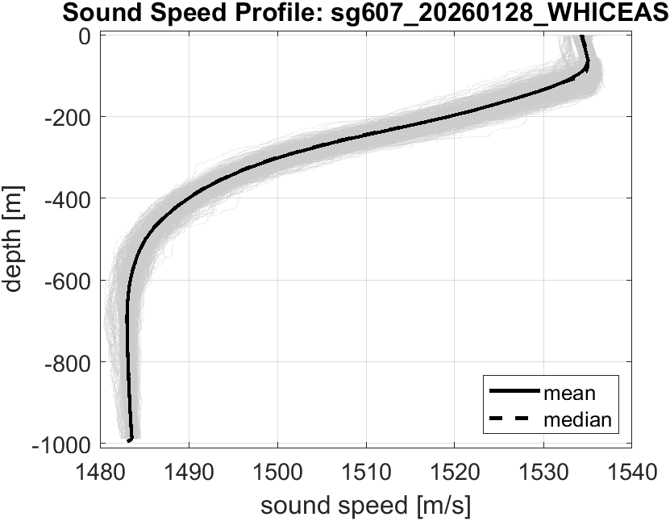

```{r tablePrep}
#| include = FALSE
library(tidyverse)
library(here)
library(knitr)
library(kableExtra)

# 1. Read the CSV file using here()
data <- read_csv(here("data/sg607_20260128/sg_fieldDefinitions.csv"))
```

# PRELIMINARY datasets for SeaGlider 'sg607'

Non-audio data from Seagliders was prepared using the Post-mission processing via [Agate (Acoustic Glider Analysis Tools and Environment, Update from 10 March 2026)](https://sfregosi.github.io/agate/). Below are descriptions of the available datasets:

## sg607_20260128_flight_timeseries_engineering.csv

The flight engineering dataset contains information on the pitch, roll, heading, and vbdCC for each dive. Methods to develop this dataset can be found here (cite!), and definitions/units for data are found in the table below. *Note: Data are preliminary and require additional QAQC.*

The two Seagliders have different CTDs (SG274 has an RBR Legato; SG607 has a Seabird); therefore, the flight data is available on two different time “scales” based on different sensor clocks. Measured engineering data is on the glider’s internal time schedule. Modeled flight data (speeds, displacement, buoyancy, etc. all are sampled at the times of the CTD data). 

```{r engineering}
#| echo = FALSE
#| 
# 2. Render and style the table
data %>% 
  filter(Dataset == "flight_timeseries_engineering") %>%
  kbl(
    align = "l", # Justify text to the left (use "c" for center or "r" for right)
    booktabs = TRUE # Clean, professional tablines
  ) %>%
  kable_styling(
    latex_options = c("striped", "HOLD_position"), # Alternating row shading (gray/white)
    bootstrap_options = c("striped", "hover", "condensed"), # Web alternative if compiling to HTML
    full_width = TRUE # Fits text across the full page width with automatic word wrap
  ) %>%
  row_spec(
    0, # Target header row
    bold = TRUE,
    extra_css = "border-bottom: 3px solid black;" # Thick bottom border for HTML
  ) %>%
  # Apply thick line underneath header for PDF/LaTeX output
  {
    if (knitr::is_latex_output()) {
      row_spec(., 0, bold = TRUE) %>%
        row_spec(0, extra_latex_after = "\\hline\\noalign{\\hrule height 1.5pt}")
    } else {
      .
    }
  }
```

## sg607_20260128_flight_timeseries_modeled.csv

The modeled dataset contains information on the estimated glider speed (including vertical and horizontal speed), glider angle, buoyancy, and displacement (nort, east). Methods to develop this dataset can be found here (cite!), and definitions/units for data are found in the table below. *Note: Data are preliminary and require additional QAQC.*

The two Seagliders have different CTDs (SG274 has an RBR Legato; SG607 has a Seabird); therefore, the flight data is available on two different time “scales” based on different sensor clocks. Measured engineering data is on the glider’s internal time schedule. Modeled flight data (speeds, displacement, buoyancy, etc. all are sampled at the times of the CTD data). 

```{r mdl}
#| echo = FALSE
#| 
data %>% 
  filter(Dataset == "flight_timeseries_modeled") %>%
  kbl(
    align = "l", # Justify text to the left (use "c" for center or "r" for right)
    booktabs = TRUE # Clean, professional tablines
  ) %>%
  kable_styling(
    latex_options = c("striped", "HOLD_position"), # Alternating row shading (gray/white)
    bootstrap_options = c("striped", "hover", "condensed"), # Web alternative if compiling to HTML
    full_width = TRUE # Fits text across the full page width with automatic word wrap
  ) %>%
  row_spec(
    0, # Target header row
    bold = TRUE,
    extra_css = "border-bottom: 3px solid black;" # Thick bottom border for HTML
  ) %>%
  # Apply thick line underneath header for PDF/LaTeX output
  {
    if (knitr::is_latex_output()) {
      row_spec(., 0, bold = TRUE) %>%
        row_spec(0, extra_latex_after = "\\hline\\noalign{\\hrule height 1.5pt}")
    } else {
      .
    }
  }
```

## sg607_20260128_GPS_timeseries.csv

GPS time series data is formatted with one row per dive, with start and end times and locations for each dive. Movement between the end of one dive and the start of the next is due to any surface drift. The GPS dataset contains information on the Start and End Time, Latitude, Longitude as well as the duration, distance, and max depth for each dive. Additional variables are presented in the table (below). Methods to develop this dataset can be found here (cite!), and definitions/units for data are found in the table below. *Note: Data are preliminary and require additional QAQC.*

```{r gps}
#| echo = FALSE
#| 
data %>% 
  filter(Dataset == "GPS_timeseries") %>%
  kbl(
    align = "l", # Justify text to the left (use "c" for center or "r" for right)
    booktabs = TRUE # Clean, professional tablines
  ) %>%
  kable_styling(
    latex_options = c("striped", "HOLD_position"), # Alternating row shading (gray/white)
    bootstrap_options = c("striped", "hover", "condensed"), # Web alternative if compiling to HTML
    full_width = TRUE # Fits text across the full page width with automatic word wrap
  ) %>%
  row_spec(
    0, # Target header row
    bold = TRUE,
    extra_css = "border-bottom: 3px solid black;" # Thick bottom border for HTML
  ) %>%
  # Apply thick line underneath header for PDF/LaTeX output
  {
    if (knitr::is_latex_output()) {
      row_spec(., 0, bold = TRUE) %>%
        row_spec(0, extra_latex_after = "\\hline\\noalign{\\hrule height 1.5pt}")
    } else {
      .
    }
  }
```

\*\* Quality flags for validity of data dependent on hydrodynamic model (valude hdm_qc):

- "Whether corrected temperatures, salinities, and velocities from the hydrodynamic model converged on a consistent solution"

- flag_values: "0 1 2 3 4 5 6 8 9"

- flag_meanings: "QC_NO_CHANGE QC_GOOD QC_PROBABLY_GOOD QC_PROBABLY_BAD QC_BAD QC_CHANGED QC_UNSAMPLED QC_INTERPOLATED QC_MISSING"

## sg607_20260128_science_timeseries.csv

The science dataset contains information on the depth, temperature, salinity, density, and sound velocity for each dive. Methods to develop this dataset can be found here (cite!), and definitions/units for data are found in the table below. *Note: Data are preliminary and require additional QAQC.*

```{r sci}
#| echo = FALSE
#| 
data %>% 
  filter(Dataset == "science_timeseries") %>%
  kbl(
    align = "l", # Justify text to the left (use "c" for center or "r" for right)
    booktabs = TRUE # Clean, professional tablines
  ) %>%
  kable_styling(
    latex_options = c("striped", "HOLD_position"), # Alternating row shading (gray/white)
    bootstrap_options = c("striped", "hover", "condensed"), # Web alternative if compiling to HTML
    full_width = TRUE # Fits text across the full page width with automatic word wrap
  ) %>%
  row_spec(
    0, # Target header row
    bold = TRUE,
    extra_css = "border-bottom: 3px solid black;" # Thick bottom border for HTML
  ) %>%
  # Apply thick line underneath header for PDF/LaTeX output
  {
    if (knitr::is_latex_output()) {
      row_spec(., 0, bold = TRUE) %>%
        row_spec(0, extra_latex_after = "\\hline\\noalign{\\hrule height 1.5pt}")
    } else {
      .
    }
  }
```

## sg607_20260128_WHICEAS_SSP.png

Soundspeed profile for the WHICEAS mission (which includes the Glider Rodeo).


