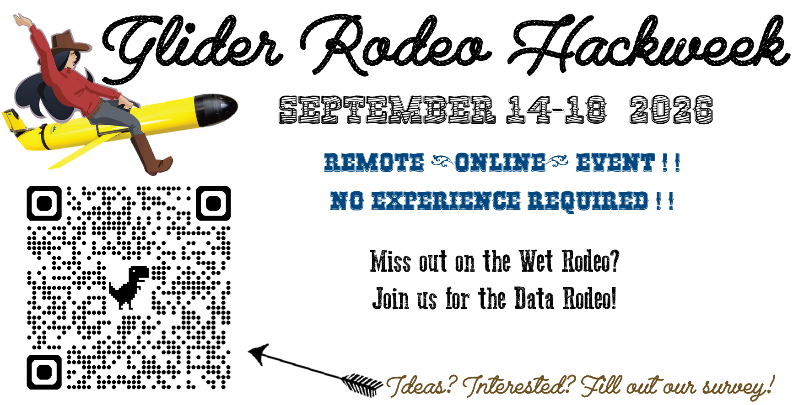

The Glider Rodeo Hackweek is a 5-day virtual collaboration where we will explore data collected from a suite of underwater gliders equipped with Passive Acoustic and CTD sensors. We will host various learning opportunities and participant-led project teams will explore areas of interest, including (but not limited to!) data exploration, analysis, and tool development.

## Objective

Our objective is to develop open-source analysis and visualization tools that evaluate glider performance during the [Glider Rodeo](https://nmfs-pam-glider.github.io/GliderRodeo/), providing the community with a framework for future studies.

## Goals

Our goals are to share this dataset with the wider community and encourage use of this data to meet a broad range of needs, foster hands-on community learning, build community and strengthen professional networks. In addition to these broad goals, we at NOAA Fisheries have our own set of initial research goals:

- Assess different piloting approaches to identify impacts on critical components (navigation, endurance, noise) and identify a set or recommendations or 'best practices'.

- Assess variation in navigation capabilities for each glider in different conditions and during different mission modes.

- Assess impact of mission modes on battery endurance and PAM data storage.

- Assess impact of self noise (and variation in self noise under different conditions) and the impact of this noise on study objectives

- Assess variation in acoustic detection of target species for different platforms in different conditions.

## Participation

- *Do you want to build community within the glider or PAM community?*

- *Do you have analyses or tools that you would like to apply to this dataset?*

- *Do you want to transfer analyses or tools developed here to your data?*

- *Are you a student in science, engineering, or software development looking for new experiences?*

- *Do you have project ideas you'd like to propose (or lead?)?*

### **Expectations:**

- No experience is necessary, although **we expect all project team participants to participate all week**.

- See the tentative [schedule](https://nmfs-pam-glider.github.io/GliderRodeo/hackathon/logistics.html#schedule) for planning purposes.

- All communications will use the [Slack platform](https://slack.com/) (can use browser or app).

### **How to Participate:**

Please fill out this [participant form](https://forms.gle/y1kFU1U13iEbww2i9), and we'll invite you to join our conversation on our Slack Workspace!

\
*Learn more about the [NOAA Fisheries PAM-Glider Program](https://nmfs-ost.github.io/PAM-Glider/) and the [Glider Rodeo](https://nmfs-pam-glider.github.io/GliderRodeo/)*
