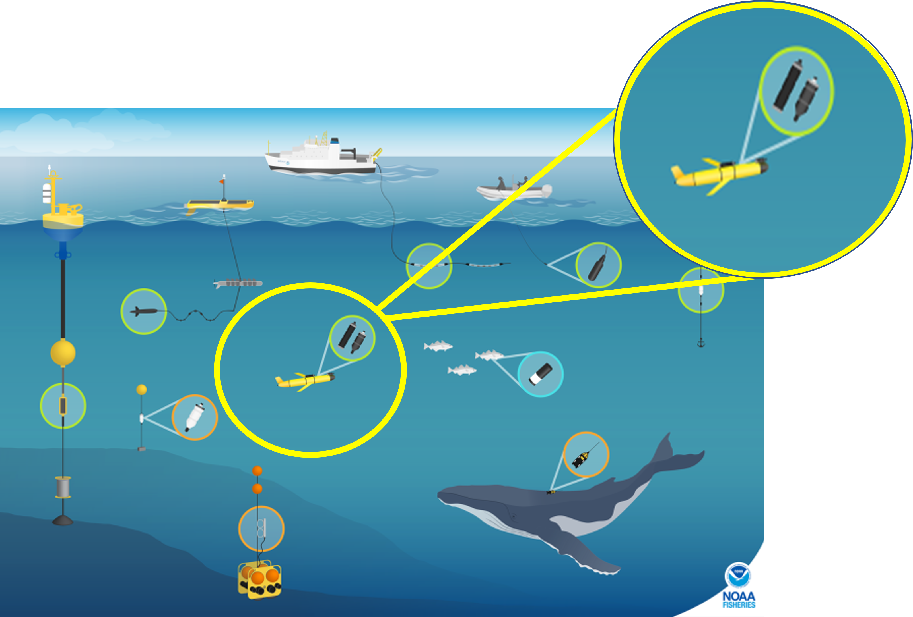
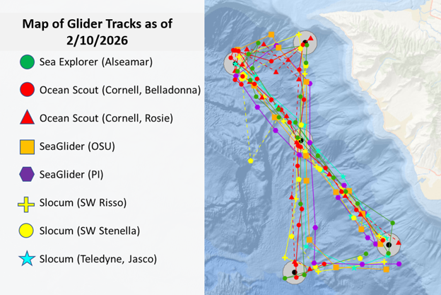
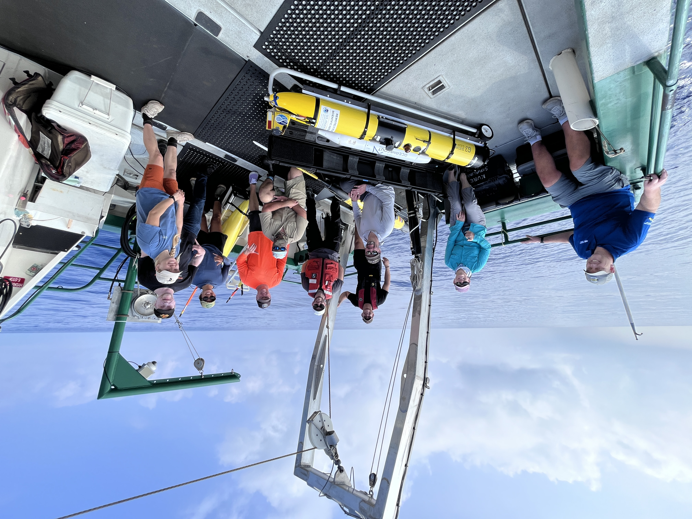
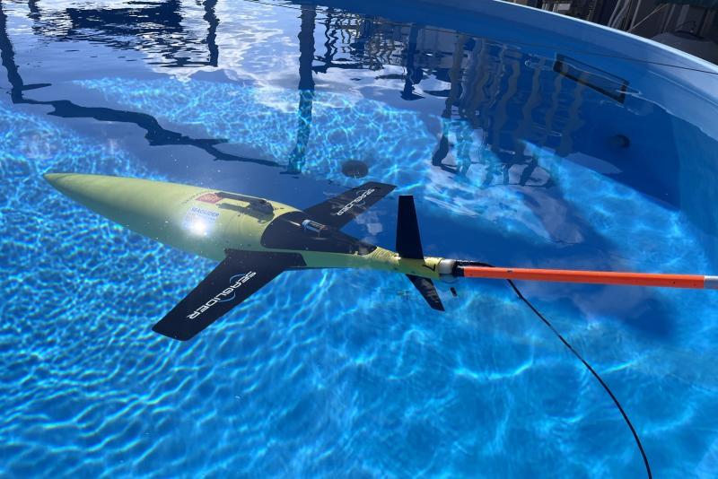
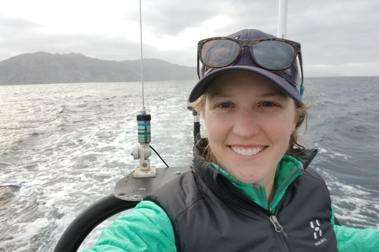
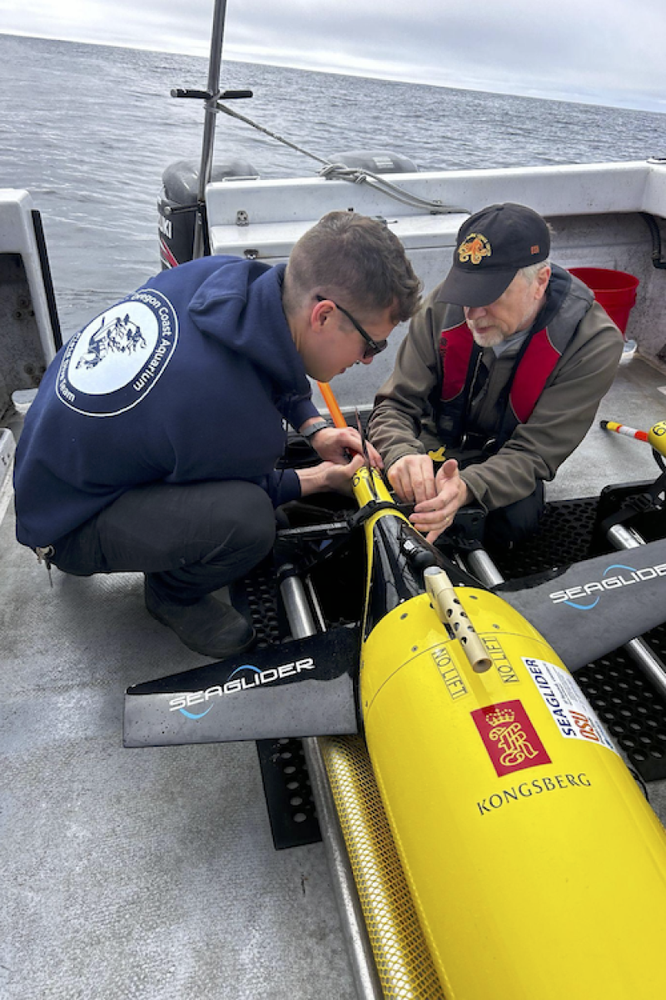

::: page-layout
::: main-content
# NOAA Fisheries PAM-Glider Rodeo 2026

Passive Acoustic Monitoring (PAM) is an effective means of monitoring marine mammals and the marine environment, and NOAA Fisheries is expanding their efforts into PAM-equipped underwater gliders as a means of conducting this research to meet their management needs.

***Why This Matters:*** NOAA Fisheries is mandated by Congress to monitor marine mammals to mitigate current risks and support sustainable oceans by improving our understanding of marine mammals as functioning parts of marine ecosystems. PAM-equipped gliders allow for a more economical approach to improving our understanding of marine mammals and supporting their long-term conservation.

{width="618"}

The NOAA Fisheries PAM 'Glider Rodeo' (aka *Underwater Glider Challenge*) is part of a larger effort to accelerate the use of PAM-Gliders to monitor and assess cetacean populations ([link to more information on the larger PAM-Glider effort](https://nmfs-ost.github.io/PAM-Glider/)). The objective of the Glider Rodeo is to field-test PAM-glider platforms to provide data-driven guidance on the capabilities of each system to (1) work in different operational environments and (2) address different research questions. This two-week sea trial was conducted off Oahu, Hawai'i in February 2026.

This research compendium provides a comprehensive collection of the digital components related to this research project, including data products, code and text (protocols, reports, metadata, etc). Raw acoustic data will be archived to NCEI at a future date.

{width="618"} 
*Information provided here is ongoing, and is frequently updated.*
:::

::: media-sidebar
### Featured
::: media-card

<a href="https://www.fisheries.noaa.gov/science-blog/sound-bytes-synchronous-swimming-robots-behind-glider-challenge">
<strong>Sound Bytes: Synchronous Swimming (With Robots) – Behind the Glider Challenge</strong> The exciting work of flying robots underwater takes science, teamwork, and flexibility</a>
:::

::: media-card
{width="218"}

<a href="https://www.fisheries.noaa.gov/science-blog/sound-bytes-meet-pilots-underwater-glider-challenge">
<strong>Sound Bytes: Meet the Pilots of the Underwater Glider Challenge</strong> A conversation with the NOAA pilots guiding gliders to capture the sounds of our ocean</a>
:::

::: media-card
{width="218"}

<a href="https://www.fisheries.noaa.gov/feature-story/noaa-fisheries-launches-underwater-glider-challenge-hawaii">
<strong>NOAA Fisheries Launches Underwater Glider Challenge in Hawai‘i</strong> NOAA Fisheries is leading a major effort to evaluate how next-generation ocean gliders can transform ocean monitoring and marine mammal conservation, while also benefitting U.S. fishermen and ocean industries</a>
:::

::: media-card
{width="218"}

<a href="https://www.fisheries.noaa.gov/science-blog/sound-bytes-its-boat-its-plane-its-passive-acoustic-ocean-glider">
<strong>Sound Bytes Blog: It's a boat, it's a plane, it's a passive
acoustic ocean glider!</strong>  Selene Fregosi (PIFSC) explains how
underwater gliders help us listen for whales! </a>
:::

::: media-card
{width="218"}

<a href="https://www.fisheries.noaa.gov/news/ocean-gliders-listen-whales-oregon-test-new-ways-count-them?utm_medium=email&utm_source=govdelivery">
<strong>Ocean Gliders Listen for Whales off Oregon in Test of New Ways
to Count Them</strong>  Passive acoustic monitoring by 'gliders' may
better detect some species </a>
:::
:::

