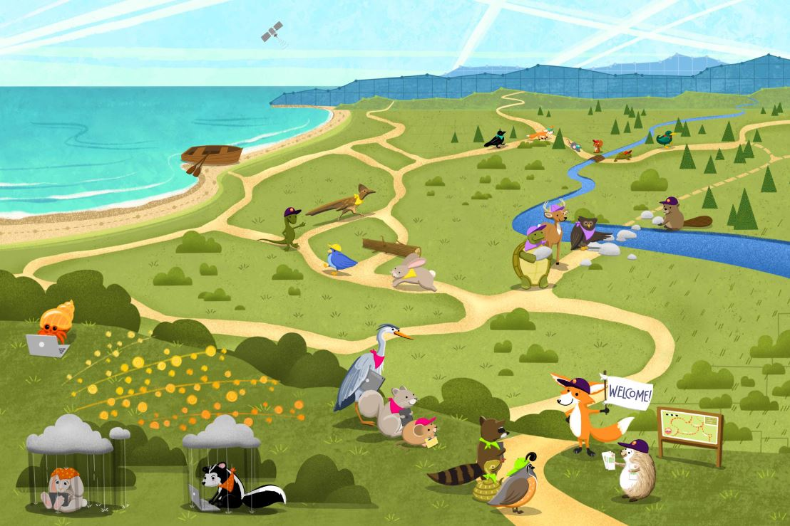
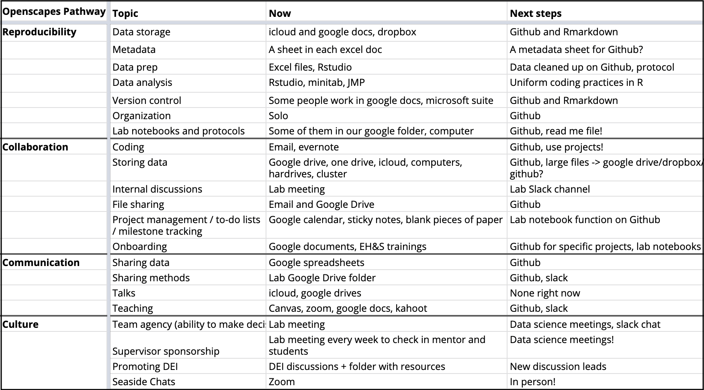

## Openscapes Pathways

[Openscapes](openscapes.org) is an open source approach and movement that helps researchers do better science, together. The Openscapes Champions Program is an open data science mentorship program for science teams, and it begins by identifying an individual or teams' 'Pathway'. The Pathways concept identifies how work is currently being done, and where they would like to go in the future with respect to reproducibility, collaboration, communication, and culture. This first step traditionally begins with a self-assessment using a [spreadsheet template](https://docs.google.com/spreadsheets/d/1rmhOly87OYrPOUqTzmccYbPrTlGmXGsN06GI1FKzxag/edit?usp=sharing).

:::::: columns
::: {.column width="40%"}

:::

::: {.column width="10%"}
<!-- spacer -->
:::

::: {.column width="40%"}

:::
::::::

For those new to open science and with limited exposure to alternative scientific cultures or ways of doing science, it can be difficult to identify what exactly you want and need. By the end of the Openscapes Champions Program, this vision of these alternatives become clear and these initial projects frequently include developing a Lab Manual (a one-stop shop for everything) or automation of part of their workflow to improve reproducibility. T

## Pathways Flowchart

The Pathways Flowchart was developed as an alternative approach to the Openscapes Pathways Spreadsheet to reduce decision-related friction and identify priority projects for automation. This approach is more complicated to initiate than the spreadsheet, but it offers great flexibility and utility. With good documentation, this approach should facilitate adoption of streamlined open science methods while learning (and reinforcing) open science methods.

The goals of the Pathways Flowchart are to:

-   Create a visual representation of your workflow (Flowchart)

-   Evaluate the potential for streamlining/automation of each component

-   Prioritize components for improvement

-   Identify templates and examples to facilitate these improvements

-   Encourage a return to the Flowchart to revise and re-evaluate to identify the next priority for improvement

-   Encourage viewing this as an iterative process, improving one component at a time

-   Encourage sharing developments as part of the Open Science process

-   Provide alternative uses of these flowcharts to serve other data science needs

This work emphasizes the iteritive nature of this process, helping users identify workflow components in a flowchart, identifying their potential for automation, and prioritizing projects based on experience, need, and potential.

{width="617"}
